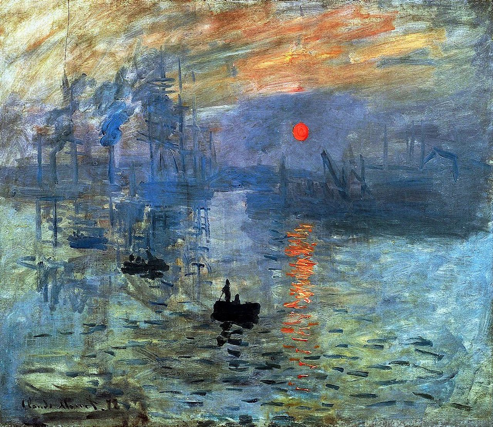
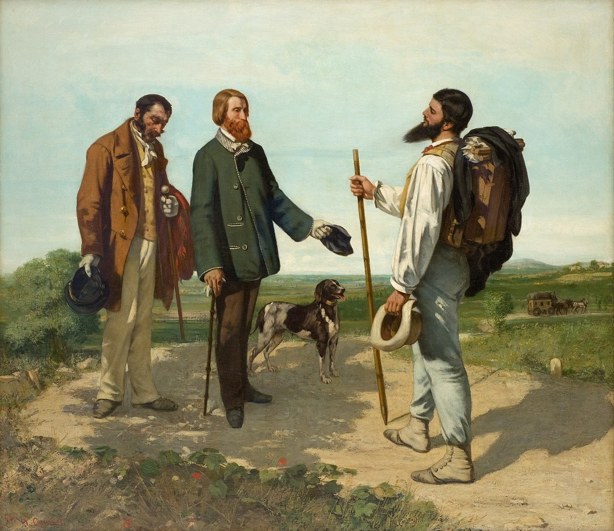
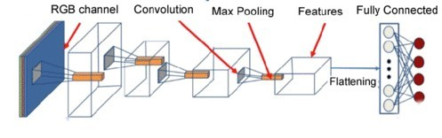
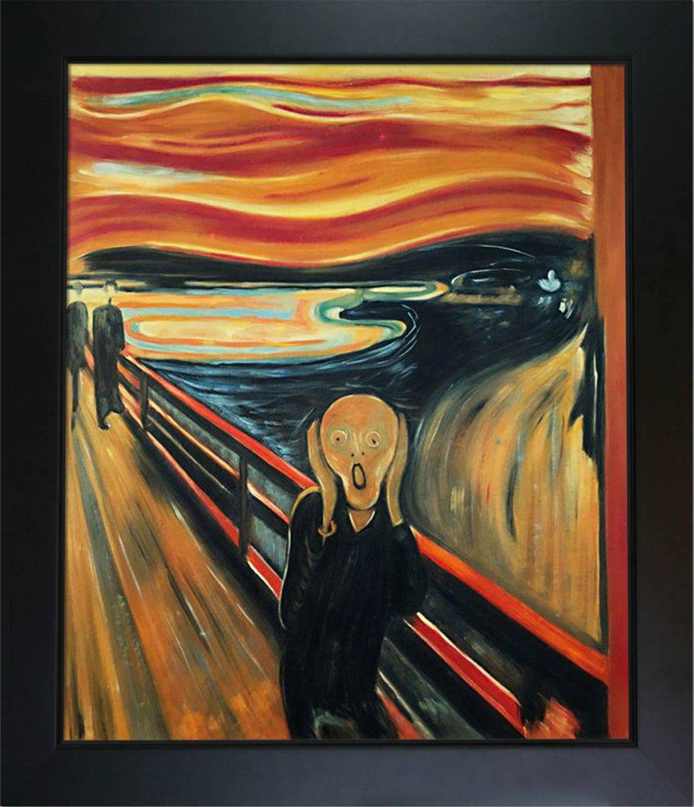
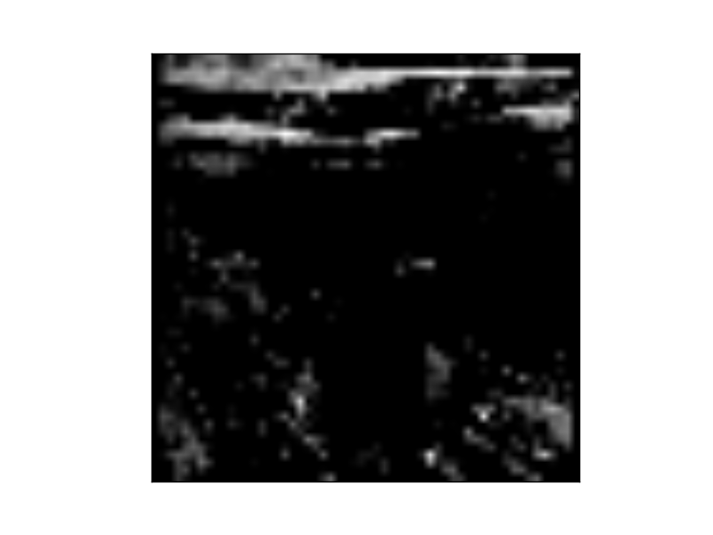
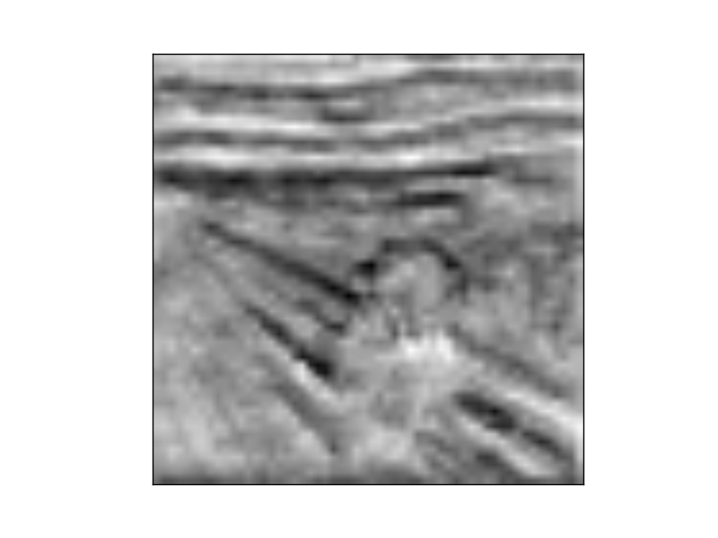

# Artwork Style Prediction

### Problem ###
For an artwork, recognizing information like visual style, medium, creation year is still a challenging problem and requires expertise of connoisseurship. In this exercise, we investigate the application of machine learning for identification of visual style​

| | 
|:---:|:---:
| Impressionism | Realism  |

### Related Work ###
The possibility of application of machine learning was previously discussed by paper titled Neural Algorithm of Artistic Style (2015) and later by RASTA (2017) where author applied CNN.​

### Our Approach ###
We evaluated ResNet50 and used transfer learning for the stated purposes. The model was trained on 5k images from WikiArt dataset which consists of 100k images of paintings of different styles, labelled with style, genre, artist and creation year​

### Methodology
Our model was built on top of state-of-the art implementation of Deep-CNN aka ResNet50. The pre-trained model consisted of two parts; Feature extractor and classifier. ​



As first step, feature extractor was kept freeze, and the last layer was fine-tuned. This layer was responsible for classification; hence it was retrained with 10 most frequent classes. The results were further improved in the next step when instead of fine-tuning last layer, we tried to retrain all fully connected layers of classifier, while increasing number of neurons/filters.​

Below are the snapshots taken from feature extractor of the famous painting, The Scream;

| |  | 
|:---:|:---:|:---:
| Orignal | Filter  | Activation Map |


### Results
Model was evaluated by Accuracy metric. The model in question achieved 20.3% accuracy over 12 epochs.​

The model can be further improved by retraining later layers of feature extractor. ResNet was originally trained on real-life objects, hence hasn't seen images of painting.


### Reference ### 
#####  API Client for Demo ##### 
* https://github.com/shahshawaiz/artwork-style-prediction​

#####  Papers #####  
* Recognizing Art Style Automatically in painting with deep learning  (2017)​
* Neural Algorithm of Artistic Style (2017)​
* The Shape of Art History in the Eyes of the Machine (2018)​

##### Reading Material ##### 
* **Visualizing Features and Activation Maps**: - https://machinelearningmastery.com/how-to-visualize-filters-and-feature-maps-in convolutional-neural-networks/​

* **Transfer Learning**: https://towardsdatascience.com/a-comprehensive-hands-on-guide-to-transfer-learning-with-real-world-applications-in-deep-learning-212bf3b2f27a​


## API Client Demo: Up and Running ##


### Setup Env. ###
```
virtualenv demo
cd demo
source bin/activate
```

### Package Installation ###
`pip3 install tensorflow==1.14 keras==2.2.5 tensorflow-estimator==1.14 pandas numpy sklearn h5py pyyaml pillow flask flask-restful`

### Prep. project ###
1. Copy demo/app.py and demo/model.py from this repo to your project
2. Download model, and use suitable model by updating its path in variable `PATH_MODEL`
https://drive.google.com/drive/folders/1eiPCR6eX00oJn0Fl1vxtZncpxddRNOsn?usp=sharing

### Run flask ###
```
export FLASK_APP=app.py
export FLASK_ENV=development
python3 app.py
```

###  Test Predictions
Request
```
curl -XPOST -H "Content-type: application/json" -d '{
	"url": "https://img.theculturetrip.com/1440x807/smart/wp-content/uploads/2017/11/n-4240-00-000027-wpu.jpg"
}' 'http://127.0.0.1:5000/'
```

Response
```
{
    "status": 200,
    "req": {
        "url": "https://img.theculturetrip.com/1440x807/smart/wp-content/uploads/2017/11/n-4240-00-000027-wpu.jpg"
    },
    "url": "https://img.theculturetrip.com/1440x807/smart/wp-content/uploads/2017/11/n-4240-00-000027-wpu.jpg",
    "predict": "Impressionism"
}
```

## TODO ##
refactor code, write tests, fix dependencies